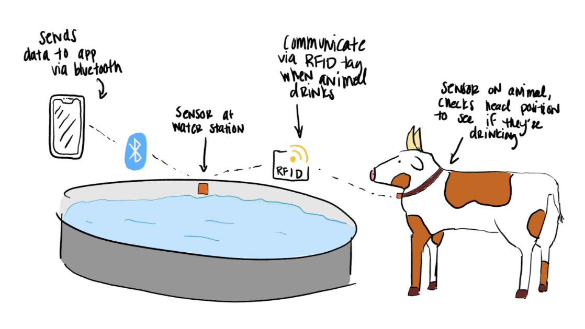

## Summary
Our proposed project is a method for tracking the hydration of animals. Dehydration in animals can lead to many health problems. This can be especially costly for livestock.
The propose solution would use sensors for tracking proximity to water sources and orientation of the head, to confirm the animal is drinking.
You can find the project proposal presentation [here](https://docs.google.com/presentation/d/1cEJiQYnhUEhbjwE6oPk1i3JMs7hYTmxlo57c02w9J9A/edit?usp=sharing)

## Abstract
Dehydration is a key health marker for animals, and yet it is not often monitored. This is because it is not easy to physiologically monitor animal hydration. However, dehydration in animals can lead to a number of health problems. Some examples are colic in livestock, urinary calculi in wethered goats and sheep, and kidney failure in dogs. This can be harmful or even devastating for the animals, as well as costly for animal owners.

There are several products for monitoring the health of an animal, such as smart collars: Cowlar (for cows) and PetPace (for dogs). However, the market products notably do not track hydration. One group in New Mexico did implement a "smart water system" that included tracking intake for cows, but it is complex, only allows one cow to drink at a time, and necessitates outfitting each water station. A solution like this is not scalable.

We propose a solution  -  WaterBoy: The animal hydration tracker. WaterBoy leverages three sensors to track when animals are drinking water. It does this by using a position sensor (such as RFID), an accelerometer (for orientation of the head), and a flex sensor (for monitoring neck size). If an animal is near to a source, the head is bowed, and the neck is repeatedly expanding and contracting, it is likely drinking. The device would record drinking data for each animal and could store it locally, or transfer data to another device over bluetooth or Wi-Fi. Data and device parameters could be displayed/modified using a mobile or web application.

For our capstone, we hope to demo this exact situation, both with a fabricate/mechanical animal model, and with a real animal. The components of the demo would include position tracking, head orientation tracking, neck size tracking, data logging, and working application. 

