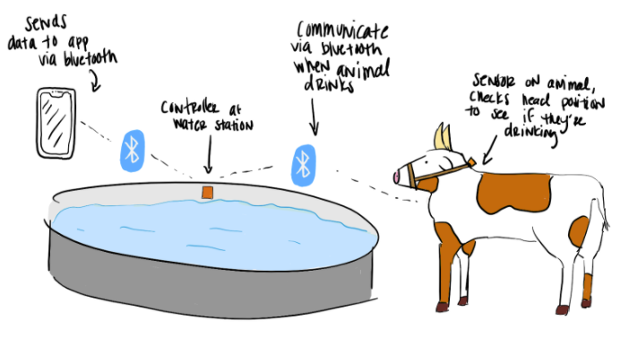
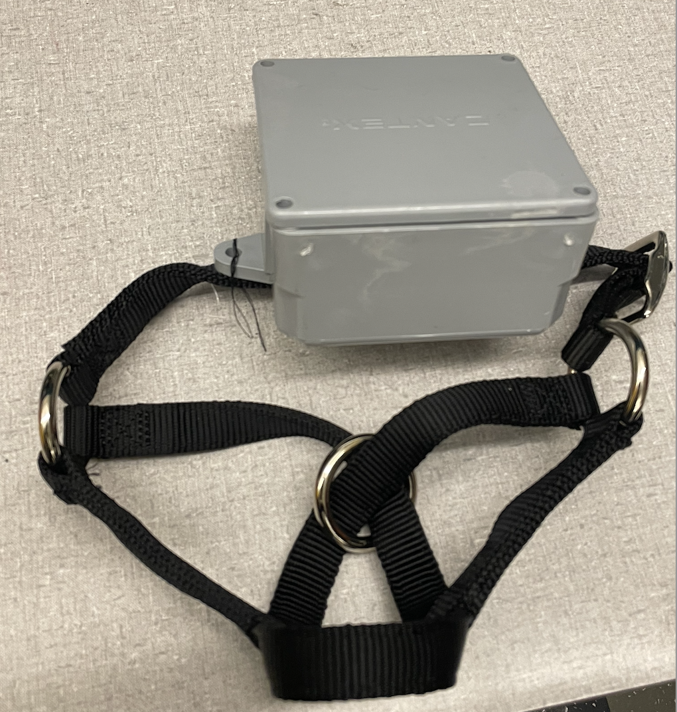
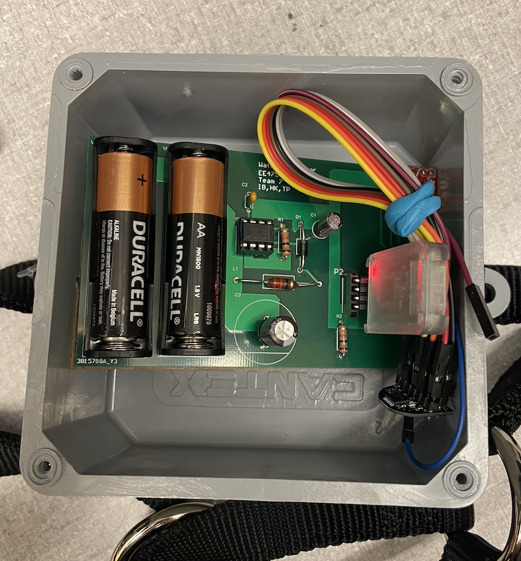

## Story
*They say an ounce of prevention is worth a pound of cure. Identify problems linked with dehydration before they turn into disasters, with WaterBoy!*

Dehydration is a key health marker for animals, and yet it is not often monitored. This is because it is not easy to physiologically monitor animal hydration. However, dehydration in animals can lead to a number of health problems. Some examples are colic in livestock, urinary calculi in wethered goats and sheep, and kidney failure in dogs. This can be harmful or even devastating for the animals, as well as costly for animal owners.

## Introducing: WaterBoy!
Our proposed solution is WaterBoy, the animal hydration tracker. WaterBoy is a system that is able to track the amount of time each of your animals has spent drinking water each day. It consists of two devices, a collar that goes on each animal and a base station at the water trough through which you can sync the data for each animal to your phone via bluetooth. The data can then be viewed inside the WaterBoy app to quickly view your animal's drinking activity, including any abnormalities in their behavior. The video [here](https://drive.google.com/file/d/1kDkgs9loUsWhVxI-bmLd2Ey3DoWfOpFU/view?usp=sharing) demonstrates WaterBoy in action! 

Below is an overview of the WaterBoy system:

Users will be able to pull data from the base station on the water supply to our mobile app! You can see the mobile app interface below, where you can view the water drinking activity of each of you animals.

## How Will WaterBoy Help?
There are several products for monitoring the health of an animal, such as smart collars: Cowlar (for cows) and PetPace (for dogs). However, the market products notably do not track hydration. One group in New Mexico did implement a “smart water system” that included tracking intake for cows, but it is complex, only allows one cow to drink at a time, and necessitates outfitting each water station. A solution like this is not scalable.

Our solution provides a low cost solution for monitoring your animal’s water intake. By monitoring your animal’s activity at water sources and reporting each animal’s individual data comprehensively through an app, you can easily discover changes in drinking behavior that may indicate any problems with your animals. They say an ounce of prevention is worth a pound of cure. Identify problems linked with dehydration before they turn into disasters, with WaterBoy!

## Features and Specifications
- Up to 2 weeks collar battery life
- Collar tracks time each animal has spent drinking at water station and sends to base station via bluetooth
- Base Station calculates distance of animal from water station to see if they are within drinking range
- Data transfer from base station to mobile app via bluetooth
- Summary of each animal’s hydration level available on app

## Risks
Technical risks of the project include estimating distance from the base station via bluetooth signal strength and power consumption of the collar and base station. However, our technical team is working to mitigate these risks using standard practices for determining bluetooth signal strength, such as RSSI, and by designing the collar for low power applications.

## Meet the Team!
### Hafsa Khan:

Hafsa is a BS/MS student at the University of Washington studying Computer Engineering. She’s passionate about anything that combines hardware and software, particularly embedded systems and digital design. Outside of work and school, she enjoys adventuring with her brothers, taking on new projects at her family farm, and backpacking. 

### Ishaan Bhimani:

Ishaan Bhimani is a Master’s student in the Electrical Engineering department at the University of Washington. His focuses are power electronics and embedded systems, and he hopes to use his career to further environmentally sustainable technology. In his free time he likes going outdoors and playing music!

### Tanpreet Plaha:

Tanpreet is a student at the University of Washington pursuing a BS in Electrical Engineering with her concentration in Embedded Systems and a BA in Philosophy. She is passionate about creating things, whether it be involving hardware and software components or glue and paper. In her free time, she likes to dive into DIY projects and read fantasy novels.

