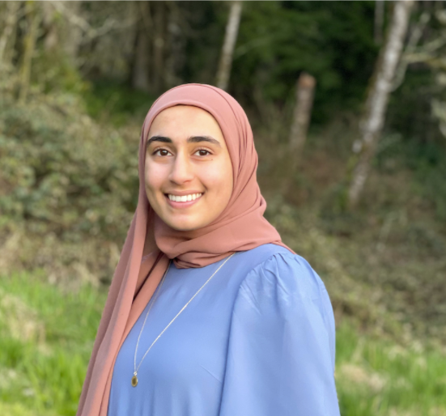

## Hafsa Khan

Hafsa is a BS/MS student at the University of Washington studying Computer Engineering. She’s passionate about anything that combines hardware and software, particularly embedded systems and digital design. Outside of work and school, she enjoys adventuring with her brothers, taking on new projects at her family farm, and backpacking. 

## Ishaan Bhimani

Ishaan Bhimani is a Master’s student in the Electrical Engineering department at the University of Washington. His focuses are power electronics and embedded systems, and he hopes to use his career to further environmentally sustainable technology. In his free time he likes going outdoors and playing music!

## Tanpreet Plaha

Tanpreet is a student at the University of Washington pursuing a BS in Electrical Engineering with her concentration in Embedded Systems and a BA in Philosophy. She is passionate about creating things, whether it be involving hardware and software components or glue and paper. In her free time, she likes to dive into DIY projects and read fantasy novels.
